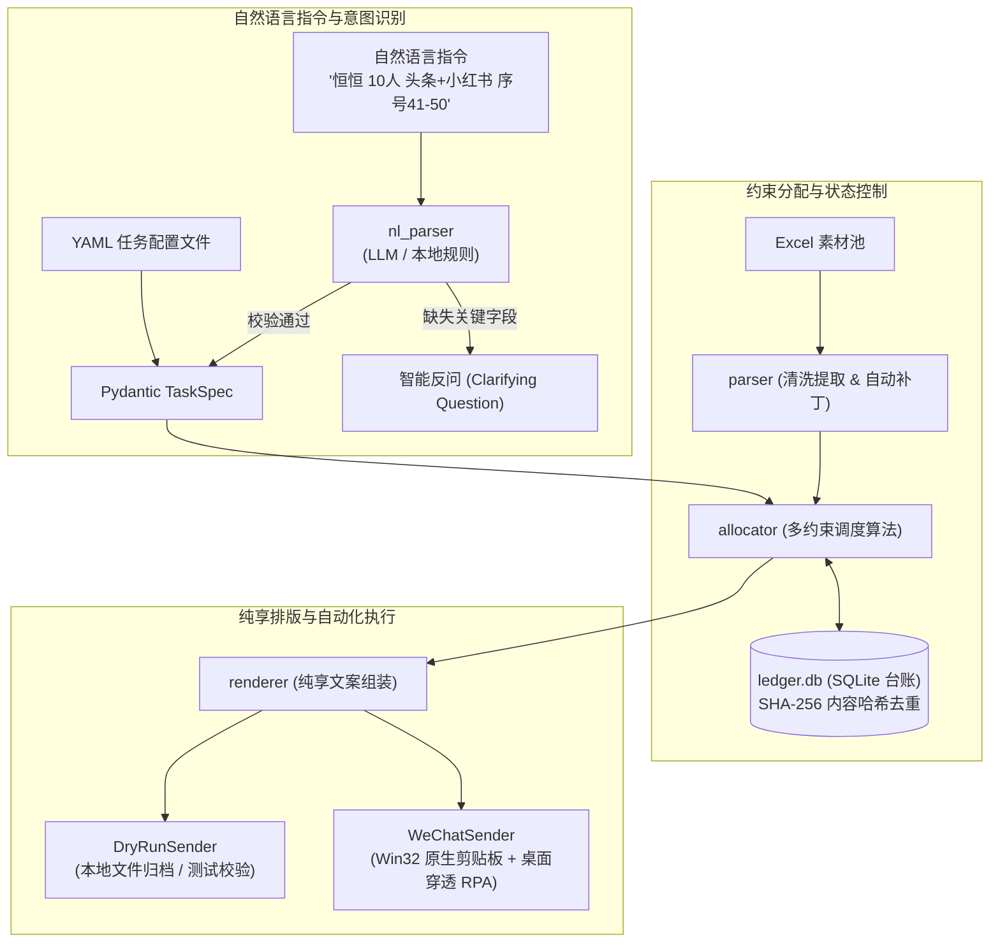

# Content Dispatch Agent (CDA)
### 营销文案智能调度与桌面分发智能体

[](https://www.python.org/)
[](LICENSE)
[]()
[](https://github.com/astral-sh/ruff)

面向品牌新品推广、KOC 内容矩阵运营场景的**智能文案调度与自动化分发系统**。  
解决多渠道、多社群、多协作人场景下，繁重的“文案切分 - 跨平台排期 - 避重校验 - 格式清洗 - 微信逐条派发”的手工劳动。

---

## 🌟 核心特性与架构



### 1. 意图解析与智能反问机制 (Intent Parsing & Clarification)
- **大模型驱动**：基于 OpenAI 兼容接口（DeepSeek / 通义千问 / Kimi），使用 JSON Schema 严格约束输出强类型 `TaskSpec`。
- **人机交互闭环**：当指令模糊或缺失必要参数（如缺少平台、序号冲突、未说明是否同文案）时，自动触发 `ClarificationRequest` 进行针对性追问。
- **离线规则引擎双保障**：内置完备的正则表达式与模式匹配引擎，无网络或无 API Key 场景下 100% 可用。

### 2. 状态台账与内容哈希去重 (SHA-256 Ledger)
- 提取每篇文案标题与正文主体生成规范化的 **SHA-256 唯一指纹**，写入 SQLite 持久化数据库。
- 彻底摒弃传统依赖人工记忆行号的做法；无论素材文件重命名、更新版本还是行号错位，实现**跨人、跨天、跨文件版本零重复**。
- 支持实时余量与库存盘点（`cda capacity`），精准评估“当前素材池还能支撑分发多少套”。

### 3. 表格鲁棒性解析 (Resilient Excel Parser)
- **底层内存热补丁**：针对第三方系统导出的 Excel 损坏空 `<fill/>` 标签导致的 openpyxl 崩溃问题，提供内存无损修复。
- **表头自适应探测**：智能识别不同列名，并优先提取带有“修正版/技术点”的正文列。
- **纯享文案清洗**：自动剔除尾部 `-----` 等人工分隔符与首尾冗余空白。

### 4. 原生 Win32 微信 RPA 注入 (Native Win32 Dispatcher)
- **原生 64 位 Unicode API**：利用 `CF_UNICODETEXT` 与显式 64 位指针类型签名，杜绝 GBK 乱码，原生支持 Emoji 表情与复杂段落换行。
- **桌面穿透技术**：挂载至 Windows `Default` 交互桌面，解决终端与任务计划程序在后台会话中的键盘模拟隔离问题。
- **智能会话锁定**：模拟快捷键全局检索目标会话（如微信“文件传输助手”），自动定位聊天输入框光标，全流程无人值守。

---

## 🚀 快速开始

### 1. 安装依赖
```bash
git clone https://github.com/YaLunZhang2002/content-dispatch-agent.git
cd content-dispatch-agent
pip install -e .
```

### 2. 生成脱敏示例素材库
```bash
# 生成包含头条、小红书、抖音三平台的脱敏示例数据
python cli.py init-mock
```

### 3. 执行分发示例

#### 方式 A：自然语言驱动（支持交互式确认）
```bash
# 本地模拟执行 (Dry Run)
python cli.py ask "恒恒 10人 头条+小红书 序号1-10 文案不同" --dry-run
```

#### 方式 B：声明式 YAML 驱动
```bash
python cli.py run examples/task_hengheng.yaml --dry-run
```

#### 方式 C：库存余量盘点
```bash
python cli.py capacity --workbook examples/sample_pool.xlsx
```

#### 方式 D：工作簿版本深度比对
```bash
python cli.py diff version_1.xlsx version_2.xlsx
```

---

## 📈 业务场景与指标价值

在真实品牌的连续 3 周新品上市多渠道推广中：
- **文案交付规模**：支撑累计 **600+ 篇次** 文案分发、**10+ 个** 核心社群对接与 **300+ 人次** KOC/素人发布节点协同。
- **触达声量测算**：基于达人平均中位数互动测算，累计覆盖潜在全网曝光量 **80 万+**。
- **提效与零差错**：将单次人工分发耗时从原本约 **2 小时** 压缩至 **5 分钟** 无人值守；实现全流程 **100% 履约按期交付** 与 **零重复失误**。

---

## 🔒 隐私脱敏与免责声明

1. **商业隐私安全**：本项目开源代码中已通过 `.gitignore` 排除所有客户真实未公开文案、商业参数、人员隐私及 API 凭证。测试运行请使用 `cli.py init-mock` 生成的合成数据。
2. **合规使用声明**：本工具设计初衷仅为**个人办公自动化协同助手**（将格式化内容分发至操作者本人的微信“文件传输助手”，再由人工进行二次复核与群内转发），不包含任何未经授权的协议逆向破解、非官方 API 调用或自动化群发骚扰功能。
